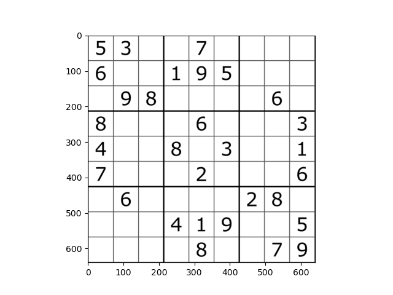
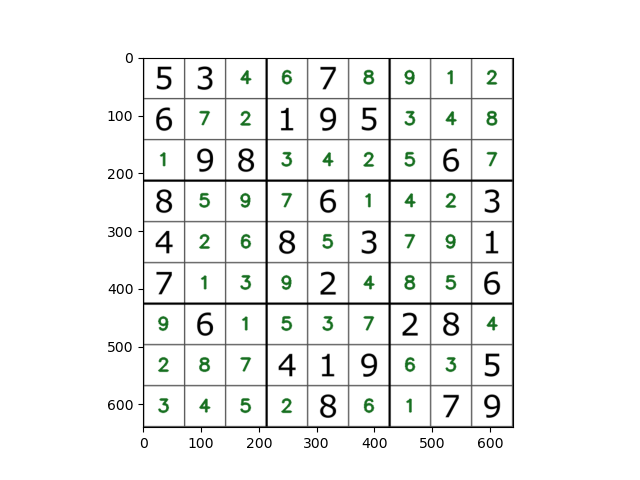

# Sudoku Solver

## Overview
This project is a Sudoku solver program that automatically solves Sudoku puzzles. The program takes an image of an unsolved Sudoku board as input and provides the solved board as output.

## Features
- Solves Sudoku puzzles automatically by using a digit recogniser trained on MNIST.
- Reads an image of a sudoku board and creates a digital representation
- Displays the solution on top of the original image

## Usage
1. Run the program: See the notebook.

## Example
Here's an example of the input and output images side by side:

| Input Image | Output Image |
|-------------|--------------|
|  |  |

## TODO
- Make sure the algorithm is more stable and works for all inputs.
- Make it solve in real-time and update it with an animation.

## Credits
This project was created by Simon Jonsson.
